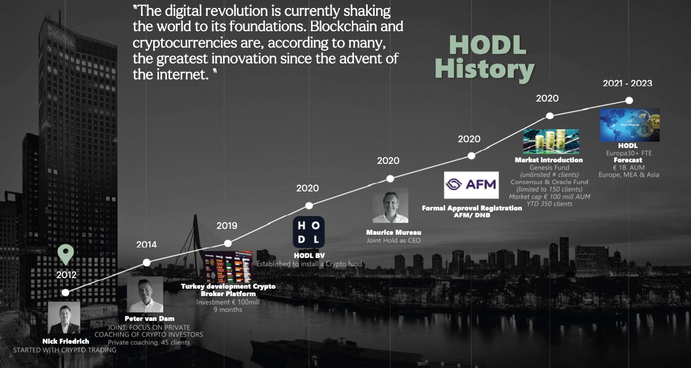

# David-Newman-s-Module-1-Challenge
Overview and Origin
Hodl (not to be confused with 21Shares:Hodl) is an up-and-coming investment fund management group that specialises in trading of cryptocurrencies. The company was officially established in 2020 in Holland, Netherlands (Hodl – about us, 2022). However, the idea for Hodl started back in 2014 when Nick Friedrich and Peter van Dam combined their expertise in cryptocurrency to establish a private investment fund targeted towards high-end clientele in Turkey(linkedin – hodl funds, 2022). However, this fund was not successful. Therefore, Nick and Peter brought on Maurice Mureau in 2020 as one of the cofounders and CEO of HODL due to his expertise in wealth management (linkedin – Hodl funds, 2022). Hodl was established because the founders could see there was a growing demand for investment in cryptocurrencies. Together, Hodl’s founders use their 65 collective years of knowledge in wealth management and cryptocurrency to help investors wanting to get into the cryptocurrencies market space (Hodl – about us, 2022).

Hodl is primarily funded through their management and performance fee structure, which are 0.5% per quarter on total invested assets and 20% on positive monthly returns, respectively (Hodl – about us, 2022). However, due to the company being privately owned, the total amount of funding raised for its conception is unknown. Conversely, Hodl business activities revolve around inhouse developed trading bots and therefore wouldn’t need much initial start-up capital to begin operations (Hodl – how it works, 2022). 

Business Activities
As mentioned before, Hodl’s key demographic are high-end investors wanting to enter the cryptoworld in a safe manner while expecting high returns. The cofounders recognised this specific financial problem and have tailor made several private funds centred around trading cryptocurrency. Currently, Hodl has approximately 350 clients spread across three investment funds on offer, each of which are nearing their €100 million euro cap (Hodl – funds, 2022). An added benefit for investors is that these funds registered in Netherlands and are fully AFM compliant (Hodl – funds, 2022). Secondly, unlike other companies, Hodl does not have any lock in terms and allows clients ease of access to their investment with a once-a-month withdrawal option for added peace of mind(Hodl – funds, 2022). Lastly, Hodl’s strategy is to utilise a combination of their expertise in investment management and developing algorithmic trading bots coupled with data analytics of cryptocurrency positions to create a diversified cryptocurrency portfolio (Hodl – how it works, 2022). Though, this last point may not be unique in the field of cryptocurrency; it has allowed Hodl to rack up returns on investments of up to 378% from the funds conception (Hodl – funds, 2022).

Landscape
Hodl’s primary domain is cryptocurrency and blockchain, however, their business activities also include the investment management domain. For the purpose of this exercise this case study will focus primarily on cryptocurrency and blockchain. Below is list some of the major trends and innovations in the cryptoworld:
•	2008: Satoshi Nakamoto (man of mystery) publishes the Bitcoin white paper, outlining its functionality on the blockchain network (Jones, 2022).
•	2009: Bitcoin is mined for the first time (Jones, 2022).
•	2011: Bitcoin reaches 1 USD (Jones, 2022).
•	2011: Litecoin joins the cyrptoworld (Jones, 2022).
•	2014: The world’s largest crypto exchange, Mt.Gox, is hacked and goes bankrupt (Jones, 2022).
•	2016: Bitcoin hits $434 USD (Jones, 2022).
•	2017: Lightning Network comes online, Bitcoin reaches $2,700 USD (Jones, 2022).
•	2019: 7 major cryptocurrency exchanges are hacked (Jones, 2022).
•	2021: Bitcoin hits all time high of $69,000 USD, market cap of cryptocurrency market surpasses $3 trillion USD (Jones, 2022).
•	2022: Covid plus high inflation hit all markets including Cryptocurrency, highlighting how the cryptocurrency sector is increasing entangled with mainstream markets (Jones, 2022).

Hodl’s fund cap of €100 million euro make them a relatively small player when considering the peak of cryptocurrency market size of 3 trillion USD back in 2021 (Jones, 2022). Therefore, due to the size of the cryptocurrency market, it is unsurprising that there are several companies offering private funds and ETF solutions similar to Hodl. This report has listed below some of Hodl’s competitors, which include major private funds and ETFs centred around cryptocurrency:
Private Funds
•	Multicoin Capital
o	Private fund focused on trading cryptocurrencies.
o	Asset Value $8.8 Billion USD (Swfinstitute, 2022).
•	PolyChain Capital
o	Private fund focused on trading cryptocurrencies.
o	Asset Value $6.6 Billion USD (Swfinstitute, 2022).
•	Pantera Capital
o	Private fund focused on trading cryptocurrencies.
o	Asset Value $1.2 Billion USD (Swfinstitute, 2022).
Public ETF Funds
•	Amplify Transformational Data Sharing
o	Invests in companies that develop blockchain technology (Amplify ETFs - BLOK, 2022)
o	Assets value of $955 million USD) (Rossolillo, 2022)
•	Bitwise 10 Crypto Index Fund
o	ETF fund focused on trading the top 10 cryptocurrencies (BITW | Bitwise 10 crypto Index Fund, 2022).
o	Asset value of $832 million USD (Rossolillo, 2022)
•	Siren Nasdaq NexGen Economy ETF 
o	Invests in companies that develop blockchain technology (Sirenetfs, 2022).
o	Asset value of $178 million USD (Rossolillo, 2022)
•	First Trust Indxx Innovative Transaction 
o	ETF fund focused on trading cryptocurrencies, tech, banking, and international stocks (First Trust Canada, 2022).
o	Asset value of $144 million USD (Rossolillo, 2022)

Results
As mentioned before, Hodl is a new and relatively small company in the multitrillion dollar cryptocurrency market. Unfortunately, Hodl’s growth has been hinder due to only being allowed to have a fund cap limit of €100 million euros (Hodl – about us, 2022). However, now that Hodl is in fully AFM compliant their aim is to start a new fund based out of Switzerland, which would allow them to trade without any fund cap and expand their company’s growth(Hodl – about us, 2022). This could allow them to become a more significant player among other cryptocurrency trading companies if they can accumulate enough investment. Nonetheless, to do so would require Hodl to continue growing their user base, which may take some convincing in the current market. As mentioned above, Hodl had experienced amazing success back in 2021 with their Genesis fund reaching 378% annual returns, significantly higher than other indices such as Bitcoin (59.76%) and S&P 500 (28.4%) (Hodl – about us, 2022) (Upmyinterest, 2022) (PK, 2022). Though, current performance of Hodl’s funds are not having the same results. The status of the funds are as follows: 
•	Genesis fund 
o	YTD -27.83%
o	+232% since inception (AFM:50025134)
o	Minimum buy in of €100,000 euros (Hodl - funds, 2022). 
•	Oracle fund 
o	YTD -37.10%
o	-61% since inception (AFM: 50026692)
o	Invitation only (Hodl - funds, 2022).
•	Consensus fund 
o	YTD -28.70%
o	+228% since inception (AFM: 50026692) 
o	Invitation only (Hodl - funds, 2022).
Poor returns by Hodl investment funds aren’t likely their fault. High global inflation rates around the world are contributing to poor performance in many ETFs and private funds. Therefore, investors should look at Hodl’s larger competitor’s performance to compare apples with apples:
Private Funds
•	Multicoin Capital
o	YTD -49.71% (Messari, 2022)
o	Data not given.
•	 PolyChain Capital
o	YTD -50.43% (Messari, 2022).
o	Data not given.
•	Pantera Capital
o	YTD -50.2% (Messari, 2022).
o	+119.6% - 44,047.5% depending on the fund (Pantera - Funds, 2022)
Public ETF Funds
•	Amplify Transformational Data Sharing 
o	YTD -39.77%
o	+20% since inception (Yahoo Finance - BLOK, 2022)
•	Bitwise 10 Crypto Index Fund 
o	YTD -63%
o	-61% since inception (Yahoo Finance - BITW, 2022)
•	Siren Nasdaq NexGen Economy ETF 
o	YTD -34%
o	+28.89% since inception (Yahoo Finance - BLCN, 2022).
•	First Trust Indxx Innovative Transaction 
o	YTD -15.61% 
o	+18.54% (Yahoo Finance - LEGR, 2022)
As we can see Hodl’s losses are somewhat comparable to the top four largest cryptocurrency ETF funds and outperforming the top three private cryptocurrency funds. The exception being First Trust Indxx, which focuses on managing a diversified portfolio rather than focusing solely on cryptocurrency (First Trust Canada, 2022).

Recommendations
When compared to some of the top private cryptocurrency funds it could be said that Hodl has done well to moderate their losses. There are likely several contributing factors why Hodl has done better than the larger private funds. One speculation is that they may have less assets to liquidate during the cryptocurrency crash (Nicolle, 2022). Similarly, Hodl YTD losses are comparable to some of the major ETF funds looked at in this report except for First Trust Indxx. Therefore, it could be recommended that Hodl follow First Trust Indxx strategy and focus on diversification of their portfolio by investing in other assets. Through diversification, First Trust Indxx has protected themselves from the volatility of recent cryptocurrency price movement. This stands to reason as we can see that First Trust Indxx YTD losses are significantly smaller compared with Hodl’s funds, other major cryptocurrency ETFs, and the major private funds looked at in this case study. Though, Hodl’s expertise are centred around cryptocurrency and blockchain, therefore, this report would recommend diversifying into non-fungible tokens (NFTs).

The NFT art market is significantly smaller compared to the cryptoworld, though, its true value is widely debated. Marketplace suggests the NFT market is valued at $8 billion USD, whereas Visa is estimating its worth being closer to $100 billion USD (Adejumo, 2022) (Mozée, 2022).
 Nevertheless, the recommendation of Hodl to diversify into NFTs stems from the fact that the NFT market is defying global trends by growing by 28% YTD (Williams, 2022).  Likewise, some experts such as Jefferies Group are predicting double digit growth in the NFT market for the next five years (Canny, 2022). If true, this would benefit Hodl by helping them rapidly grow their limitless Switzerland based fund, which would undoubtedly attract new clients. Additionally, If Hodl were to throw their weight around in the NFT market they could become a big fish in a small pond with current top private NFT funds being only at the $100 million USD mark (Collective Shift. 2022). 

NFT art is blockchain technology, which Hodl’s founder are exceedingly familiar with. Hodl could potentially repurpose trading bots to focus on particular NFTs in order to buy in at the correct time. A caveat to this suggestion is that picking NFT art that will increase in value may require a human touch as good art is subjective. Therefore, Hodl would likely need to use a combination of human intervention, big data analytics, and their trading bots to be successful in the NFT market space.

 Bibliography
•	Hodl. 2022. About us. [online] Available at: <https://www.hodl.nl/en/about-us/> [Accessed 17 August 2022].
•	linkedin. 2022. hodl-funds. [online] Available at: <https://www.linkedin.com/company/hodl-funds/?original_referer=https%3A%2F%2Fwww.hodl.nl%2F> [Accessed 17 August 2022].
•	Hodl. 2022. How do our Cryptocurrency Investment Funds work?. [online] Available at: <https://www.hodl.nl/en/how-it-works/> [Accessed 17 August 2022].
•	Jones, E., 2022. A brief history of cryptocurrency. [online] Cryptovantage. Available at: <https://www.cryptovantage.com/guides/a-brief-history-of-cryptocurrency/> [Accessed 17 August 2022].
•	Swfinstitute.org. 2022. Top 13 Crypto Fund Manager Managers by Managed AUM - SWFI. [online] Available at: <https://www.swfinstitute.org/fund-manager-rankings/crypto-fund-manager> [Accessed 17 August 2022].
•	Amplify ETFs. 2022. Amplify ETFs - BLOK. [online] Available at: <https://amplifyetfs.com/blok/> [Accessed 17 August 2022].
•	Rossolillo, N., 2022. Investing in Cryptocurrency ETFs. [online] The Motley Fool. Available at: <https://www.fool.com/investing/stock-market/market-> [Accessed 17 August 2022].
•	Bitwise Investments. 2022. BITW | Bitwise 10 Crypto Index Fund. [online] Available at: <https://bitwiseinvestments.com/crypto-funds/bitw> [Accessed 17 August 2022].
•	Firsttrust.ca. 2022. First Trust Indxx Innovative Transaction and Process ETF (BLCK) | First Trust Canada. [online] Available at: <https://www.firsttrust.ca/Retail/Etf/EtfSummary.aspx?Ticker=BLCK> [Accessed 17 August 2022].
•	Upmyinterest. 2022. Bitcoin - Bitcoin (Cryptocurrency). [online] Available at: <https://www.upmyinterest.com/fund?tick=Bitcoink=Bitcoin> [Accessed 17 August 2022].
•	Messari.io. 2022. [online] Available at: <https://messari.io/screener/multicoin-capital-portfolio-85C82968> [Accessed 17 August 2022].
•	Sirenetfs. 2022. Siren Nasdaq NexGen Economy ETF (BLCN). [online] Available at: <https://www.sirenetfs.com/siren-nasdaq-nexgen-economy-etf-blcn/> [Accessed 17 August 2022].
•	K, P., 2022. 2021 S&P 500 Return. [online] DQYDJ – Don't Quit Your Day Job... Available at: <https://dqydj.com/2021-sp-500-return/> [Accessed 17 August 2022].
•	Pantera. 2022. Funds | Pantera. [online] Available at: <https://panteracapital.com/funds/> [Accessed 17 August 2022].
•	Finance.yahoo.com. 2022. Yahoo is part of the Yahoo family of brands. [online] Available at: <https://finance.yahoo.com/quote/BLOK/> [Accessed 17 August 2022].
•	Finance.yahoo.com. 2022. Yahoo is part of the Yahoo family of brands. [online] Available at: <https://finance.yahoo.com/quote/LEGR/> [Accessed 17 August 2022].
•	Finance.yahoo.com. 2022. Yahoo is part of the Yahoo family of brands. [online] Available at: <https://finance.yahoo.com/quote/BLCN/> [Accessed 17 August 2022].
•	Finance.yahoo.com. 2022. Yahoo is part of the Yahoo family of brands. [online] Available at: <https://finance.yahoo.com/quote/BITW/> [Accessed 17 August 2022].
•	Williams, M., 2022. NFT Market Size up 28% YTD – How to Track. [online] Business 2 Community. Available at: <https://www.business2community.com/nft-news/nft-market-size-how-to-track-02467120> [Accessed 17 August 2022].
•	Adejumo, O., 2022. Report: NFT Market Valuation to Rise to Over $13 Billion by 2027 - BeInCrypto. [online] BeInCrypto. Available at: <https://beincrypto.com/report-nft-market-valuation-to-rise-to-over-13-billion-by-2027/> [Accessed 17 August 2022].
•	Nicolle, E., 2022. A $2 Trillion Free-Fall Rattles Crypto to the Core. [online] Bloomberg.com. Available at: <https://www.bloomberg.com/news/articles/2022-06-26/crypto-winter-why-this-bitcoin-bear-market-is-different-from-the-past> [Accessed 17 August 2022].
•	Mozée, C., 2022. Visa is launching an NFT program for small businesses as it sees e-commerce opportunities in a $100 billion 'creator economy'. [online] Markets Insider. Available at: <https://markets.businessinsider.com/news/currencies/nft-visa-program-creators-economy-crypto-artists-cryptopunks-ecommerce-payments-2022-3> [Accessed 17 August 2022].
•	Canny, W., 2022. Jefferies Sees the NFT Market Reaching More Than $80B in Value by 2025. [online] Coin Desk. Available at: <https://www.coindesk.com/business/2022/01/20/jefferies-sees-the-nft-market-reaching-more-than-80-billion-in-value-by-2025/> [Accessed 17 August 2022].
•	Collective Shift. 2022. 2022 List of NFT Funds & Collector DAOs — Collective Shift. [online] Available at: <https://collectiveshift.io/nft/nft-funds-and-collector-dao-list/> [Accessed 17 August 2022].

